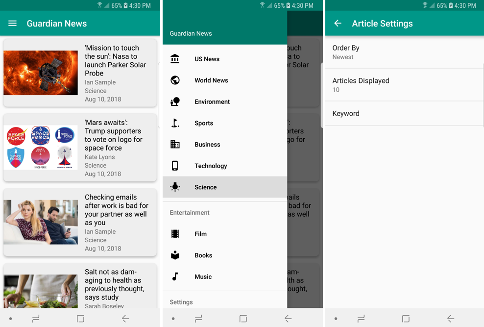

# Guardian News

A news app for articles from the Guardian.

* Built for API 15 or higher
* Two activities: MainActivity and SettingsActivity
* Data parsed using JSON from the Guardian API found here: https://open-platform.theguardian.com/

## Basic structure:

A RecyclerView displays a list of CardViews containing data about each article, such as title, contributor, section, date and thumbnail image.

Selecting a list item will send an implicit intent to open a web browser.

A Loader is used to fetch Article data. If there is no internet connection, a TextView will display a no connection error message.

If there is no data found, a TextView will display a no articles error message.

A SwipeRefreshLayout is used so the user can swipe down to refresh the screen.

## Additions for Stage 2 project:

A Navigation Drawer displays several sections of articles, such as US News and World News.

The SettingsActivity displays 3 preferences: Order By, Articles Displayed, and Keyword.

Thumbnail images for articles, when provided, are displayed.

Icons courtesy of Material Icons: https://material.io/tools/icons/?style=baseline